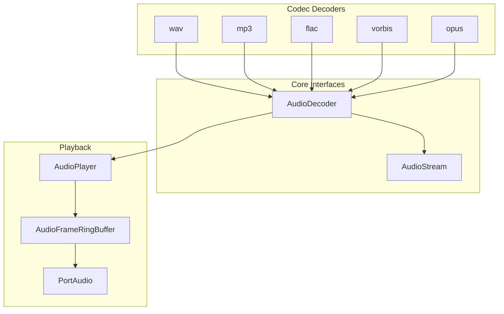
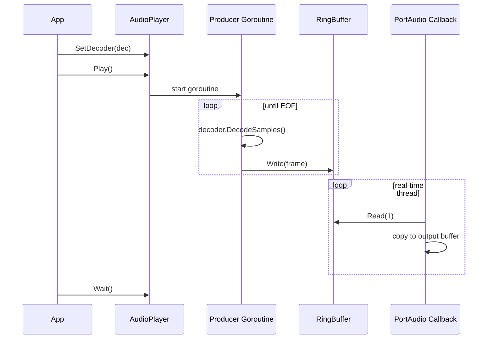

# audiokit Design

## Architecture

## Audio Playback Pipeline

## Thread Safety Model

The `AudioPlayer` uses a **Single-Producer Single-Consumer (SPSC)** pattern:

- **Producer goroutine** - decodes audio and writes frames to the ring buffer
- **PortAudio C callback thread** - reads frames from the ring buffer and copies to output
- **Atomic operations** for all shared state (`producerDone`, `playbackComplete`, `draining`)
- **Deep copy** of frame data to prevent buffer corruption across thread boundary
